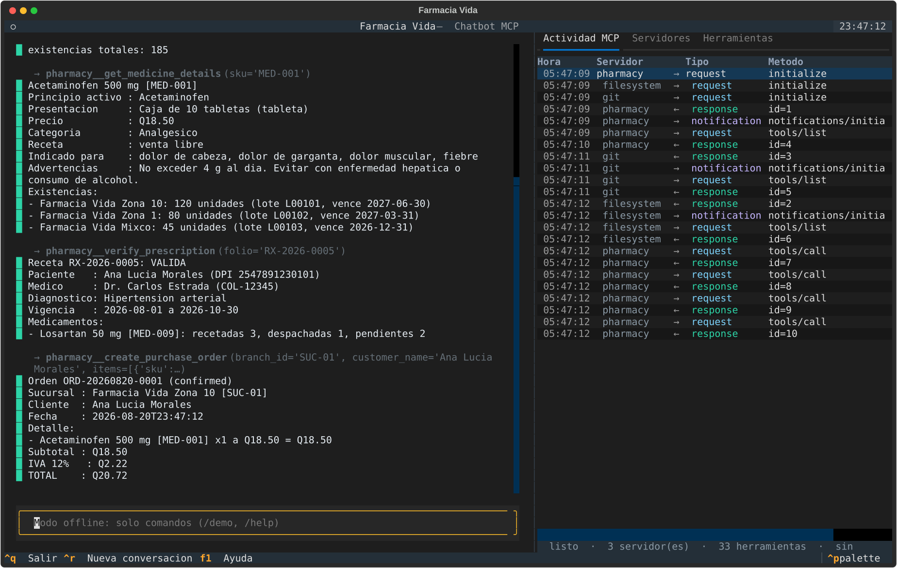
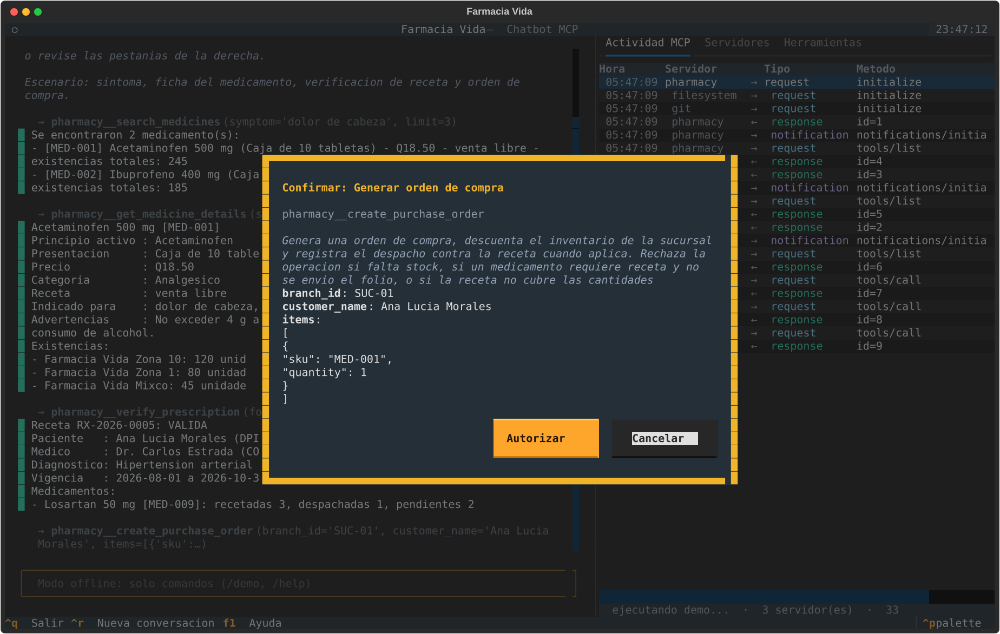

# Pharmacy MCP Chatbot

Course project for **CC3067 Redes** (Universidad del Valle de Guatemala): a
terminal chatbot that acts as an **MCP host**, talking to several Model Context
Protocol servers over JSON-RPC 2.0.

The protocol is implemented **by hand**. No MCP SDK (FastMCP or otherwise) is
used anywhere in this repository: every `initialize`, `tools/list` and
`tools/call` frame is built, framed and parsed by the code under `src/core/`.

## Use case

A pharmacy chain assistant. Through its own MCP server the chatbot can look up
medicines by symptom or name, check stock across branches, validate a medical
prescription and turn it into a purchase order.

## Stack

| Piece | Choice | Why |
| --- | --- | --- |
| Language | Python 3.11 | asyncio makes concurrent MCP sessions straightforward |
| LLM | Google Gemini (`google-genai`) | native function calling, generous free tier |
| Local transport | stdio (one JSON object per line) | what the official MCP servers speak |
| Remote transport | Streamable HTTP on Cloud Run *(delivery 2)* | keeps the same Python server behind a different transport |
| UI | Textual TUI | required to run in a terminal |
| Storage | SQLite | a real transactional inventory, no extra dependency |

## Project layout

```
src/core/
  jsonrpc.py            JSON-RPC 2.0 messages, builders, parser, error codes
  config.py             settings loaded from .env
  logging_setup.py      diagnostic logging (file + console)
  transport/
    base.py             Transport interface (stdio now, HTTP in delivery 2)
    stdio.py            client side: runs an MCP server as a child process
    stdio_server.py     server side: stdin/stdout loop
  mcp/
    types.py            MCP data model and method names
    client.py           session: handshake, id correlation, tools
    server.py           tool registry, dispatch, schema validation
    protocol_log.py     audit log of every MCP message (requirement #3)
src/servers/pharmacy/
  __main__.py           entry point of the pharmacy server
  tools.py              the seven tools and their JSON Schemas
  database.py           SQLite layer and the business rules
src/host/
  registry.py           one MCP client per configured server, namespaced tools
  conversation.py       history that keeps the session context
  agent.py              tool-calling loop and the approval gate
  workspace.py          sandbox the official servers are restricted to
  llm/schema.py         MCP inputSchema -> Gemini FunctionDeclaration
  llm/gemini.py         Gemini client, automatic function calling disabled
src/tui/                Textual interface: layout, widgets, approval dialog
src/main.py             entry point (Textual by default, --repl for console)
config/servers.json     which MCP servers to launch
data/pharmacy_seed.json catalogue, inventory and prescriptions
docs/                   server specification
tests/                  unit, dispatch, agent and end-to-end tests
scripts/                runnable demos
```

## Install

```bash
python -m venv .venv
.venv\Scripts\activate        # Windows;  source .venv/bin/activate on Linux/macOS
pip install -r requirements.txt
copy .env.example .env        # then paste your GEMINI_API_KEY
```

## Verify the protocol core

```bash
python -m pytest -q
```

```bash
python scripts/demo_protocol.py
```

The demo opens a real MCP session against `tests/fixtures/mock_mcp_server.py`
and prints every message exchanged, labelled as synchronization, request,
response or error. The same trace is appended to `logs/mcp_protocol_*.jsonl`.

## Run the chatbot

```bash
python src/main.py
```



The conversation owns the left column because it is the primary task; the MCP
log, the servers and the tools sit in tabs on the right, where they can be
consulted without interrupting the chat. Tool activity is printed inline and
dimmed, so a pause is always explained.

Needs `GEMINI_API_KEY` in `.env`. Inside the app: `/demo`, `/workspace`,
`/save`, `/reset`, `/help`, plus F1, Ctrl+R and Ctrl+Q.

**Without a key** everything except the model still works — the servers connect
and `/demo` runs a full pharmacy scenario, confirmation dialog included:

```bash
python src/main.py --offline
```

There is also a plain console chat, useful for screenshots, for debugging and as
a fallback if the terminal misbehaves during a demo:

```bash
python src/main.py --repl
```

Once a key is available, this checks the whole path in one shot — schema
translation, function calling, MCP invocation and context across two turns:

```bash
python scripts/check_gemini.py
```

### Anything that writes is confirmed first



The host asks before running any tool the server does not mark as
`readOnlyHint`. The dialog lists the full arguments, so what is confirmed is a
concrete order; the reversible option holds the focus and Escape cancels.

### How a turn works

1. The user writes; the history so far goes to Gemini together with every MCP
   tool, translated from JSON Schema into function declarations.
2. If the model answers with function calls, the host runs them against the
   right server, feeds the results back, and asks the model again.
3. Anything the server does **not** mark as `readOnlyHint` is confirmed with the
   user first. Today that is only `create_purchase_order`, the one tool that
   writes — the host reads that from the protocol, it has no hardcoded list.
4. The loop stops when the model answers with text, or after `max_steps`.

Automatic function calling in the SDK is disabled on purpose: the tools live
behind MCP, so the host decides what runs.

## Official MCP servers

The chatbot also drives the two official Anthropic servers, declared in
[config/servers.json](config/servers.json) alongside the pharmacy one:

| Server | Command | Tools |
| --- | --- | --- |
| `filesystem` | `npx -y @modelcontextprotocol/server-filesystem <workspace>` | 14 |
| `git` | `python -m mcp_server_git` | 12 |

```bash
python scripts/demo_official_servers.py
```

That runs the scenario the statement suggests: prepare a repository, write a
README through the Filesystem server, stage it with `git_add`, commit it with
`git_commit` and read the history back with `git_log` — then queries the
pharmacy server in the same session, to show the three coexisting under one
host.

Two things worth knowing:

- **The sandbox.** The Filesystem server is started with `workspace/` as its
  only allowed root, so the chatbot cannot read or write anything else on the
  machine. Paths outside it come back as an error from the server itself.
- **The Git server cannot create repositories.** `mcp-server-git` exposes twelve
  tools and `git_init` is not among them, in any published version. So the host
  prepares empty repositories inside the sandbox — automatically at startup, or
  with `/workspace <name>` — and every actual git operation goes through the
  official server.

The approval gate needed no changes for these servers: they declare
`readOnlyHint` in their tool annotations, so `write_file`, `edit_file`,
`git_commit` and friends are confirmed with the user, while `read_file` and
`git_log` are not.

## The pharmacy MCP server

Seven tools: `list_branches`, `search_medicines`, `get_medicine_details`,
`check_inventory`, `verify_prescription`, `create_purchase_order` and
`get_order`. Full specification, arguments, error codes and wire examples in
[docs/pharmacy-mcp-server.md](docs/pharmacy-mcp-server.md).

Run the whole scenario — symptom, medicine details, an antibiotic refused for
lack of a prescription, prescription check, and the resulting order:

```bash
python scripts/demo_pharmacy.py
```

The server is a normal MCP server: it also works from Claude Desktop or any
other host, see the configuration snippet in the specification.

The database is built from `data/pharmacy_seed.json` on first run. Deleting
`data/pharmacy.db` restores the seeded stock and prescriptions.

## Report

[docs/reporte-entrega1.md](docs/reporte-entrega1.md) covers items 8 and 10 of the
statement for the local servers: full specification, the error model, the
interface decisions, the difficulties found and the conclusions.

## Roadmap

- [x] JSON-RPC 2.0 core, MCP session lifecycle, protocol log
- [x] Pharmacy MCP server (local, stdio)
- [x] Gemini host with conversation context and tool-calling loop
- [x] Official Filesystem and Git MCP servers
- [x] Textual TUI and written report
- [ ] Remote server on Cloud Run + Wireshark analysis *(delivery 2)*
